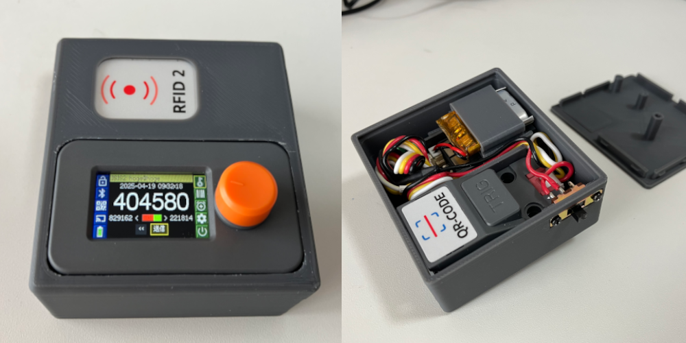

# 2段階認証デバイス M5 Authenticator
M5Stackの[DinMeter](https://shop.m5stack.com/products/m5stack-din-meter-w-m5stamps3)を使用した二段階認証デバイスです。本体にQRコードリーダーとRFIDリーダーを内蔵していて、単独で2段階認証デバイスとして機能します。保存したデータは暗号化され、NFCカード内の秘密鍵で複合化することでセキュリティを確保しています。

# 機能
* TOTPの生成
* QRコードリーダーによるキーの追加
* NFCカードによる認証
* AES 256bitで秘密鍵を保護
* Bluetoothキーボードとして動作しPCへ送信
* バーコードリーダー機能
* 内蔵Webサーバー(https)を介したデータのバックアップ・リストア
* Wi-Fi接続による時刻の同期
* バッテリー駆動（やや難あり）

# 詳しい説明
詳細は以下のブログに掲載しています。 
[https://akibabara.com/blog/7900.html](https://akibabara.com/blog/7900.html)

# 使用ハードウェア
* M5Stack [DinMeter](https://shop.m5stack.com/products/m5stack-din-meter-w-m5stamps3)
* M5Stack [QR Code Scanner Unit](https://shop.m5stack.com/products/qr-code-scanner-unit-stm32f030)
* M5Stack [RFID 2 Unit](https://shop.m5stack.com/products/rfid-unit-2-ws1850s)

# 対応NFCカード
* Mifare Classic 1K
* NTAG213 (144byte)
* NTAG215 (504byte)
* NTAG216 (888byte)
